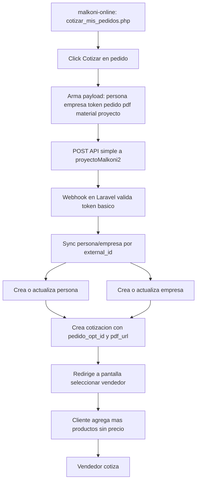

# PLAN DE TRABAJO - SPRINT FINAL (1 SEMANA)

**Fecha**: 22 de junio de 2026  
**Proyecto**: Integracion proyectoMalkoni2 <-> malkoni-online  
**Equipo**: 3 personas  
**Plazo**: 1 semana  
**Enfoque**: entrega funcional para proyecto final (prioridad en flujo operativo, seguridad basica)

---

## 1. Objetivo del Sprint

Entregar un flujo completo y demostrable donde:
1. El cliente selecciona un pedido en malkoni-online.
2. Se envian los datos del pedido (incluido PDF de plano) al nuevo sistema.
3. El nuevo sistema sincroniza usuario/empresa (si no existe crea, si existe actualiza).
4. Se crea la cotizacion y se abre la pantalla para seleccionar vendedor.
5. Se pueden agregar mas productos sin mostrar precios al cliente.
6. El vendedor queda habilitado para cotizar.

---

## 2. Alcance Prioritario (MVP de entrega)

### Debe quedar listo si o si
- Conexion entre ambos sistemas via API.
- Envio del pedido seleccionado desde malkoni-online al nuevo sistema.
- Recuperacion y uso del PDF del pedido seleccionado.
- Upsert de persona y empresa en proyectoMalkoni2 (crear o actualizar por external_id).
- Creacion de cotizacion con datos del pedido OPT.
- Pantalla de asignacion/seleccion de vendedor funcionando.
- Cliente puede agregar productos a la cotizacion sin ver precios.
- Flujo vendedor para cotizar.

### Importante pero simplificado
- Seguridad y autenticacion: nivel basico (token compartido simple y validaciones minimas).
- Sesiones: funcionales y estables para demo, sin arquitectura compleja.

### No prioritario para esta semana
- Hardening de seguridad avanzado.
- Refactor grande de arquitectura.
- Automatizacion CI/CD completa.

---

## 3. Flujo Tecnico Final (actualizado)



### Payload minimo recomendado

```json
{
    "persona_external_id": 123,
    "empresa_external_id": 456,
    "empresa_activa_external_id": 456,
    "token_opt": "abc123...",
    "pedido_id": 4926740,
    "pdf_url": "https://optionline-prod-files.s3.amazonaws.com/planos/4926740_.pdf",
    "project": "Proyecto A",
    "mat_descri": "Melamina Blanco 18mm",
    "cant_placas": 4
}
```

---

## 4. Reglas de Negocio para esta Entrega

- El cliente no ve precios en ninguna pantalla de cliente.
- Los datos personales se editan solo en online.malkoni.com.ar.
- En proyectoMalkoni2 los datos se sincronizan cuando el cliente inicia flujo de cotizacion.
- Se usa empresa activa para la cotizacion, no empresa principal historica.
- Si persona/empresa ya existen en proyectoMalkoni2, se actualizan (no se duplican).

---

## 5. Distribucion de Trabajo (3 personas)

## Persona 1 - Integracion

### Objetivo
Dejar operativo el flujo entre sistemas de punta a punta.

### Tareas
1. Actualizar boton Cotizar en malkoni-online para que haga POST real.
2. Enviar pedido seleccionado + pdf_url + datos de usuario/empresa.
3. Implementar endpoint receptor en proyectoMalkoni2.
4. Implementar sync upsert de persona/empresa por external_id.
5. Crear cotizacion inicial y redirigir a seleccionar vendedor.
6. Probar flujo completo con 2-3 casos reales.

### Archivos objetivo
- malkoni-online/public/Dashboard/cotizar_mis_pedidos.php
- proyectoMalkoni2/routes/web.php (o routes/api.php)
- proyectoMalkoni2/app/Http/Controllers/Api/OPTWebhookController.php
- proyectoMalkoni2/app/Services/ExternalApiService.php
- proyectoMalkoni2/app/Models/Persona.php
- proyectoMalkoni2/app/Models/Empresa.php
- proyectoMalkoni2/app/Models/Cotizacion.php
- proyectoMalkoni2/database/migrations/* (campos faltantes)

## Persona 2 - Frontend y funcionalidades de negocio

### Objetivo
Cerrar experiencia de uso y funcionalidades pendientes visibles.

### Tareas
1. Chat cliente-vendedor integrado y usable.
2. Pantallas de cliente sin precios.
3. Pantalla seleccionar vendedor clara y funcional.
4. Flujo para agregar mas productos a cotizacion.
5. Mejoras visuales generales de UX para demo.

### Archivos objetivo
- resources/views/cliente/*
- resources/views/vendedor/*
- resources/views/components/*
- resources/js/*

## Persona 3 - Login, sesiones, metricas y OPT

### Objetivo
Terminar accesos por rol y funcionalidades de soporte a la demo.

### Tareas
1. Login separado para vendedor y supervisor.
2. Manejo de sesiones estable (sin caidas entre pantallas).
3. Conexion del boton Ir al OPT usando token del usuario logueado.
4. Estadisticas y metricas funcionando con datos reales del sistema.
5. Ajustes de dashboard para presentacion.

### Archivos objetivo
- routes/web.php
- app/Http/Controllers/*DashboardController.php
- resources/views/supervisor/*
- resources/views/vendedor/*
- resources/js/*

---

## 6. Plan Diario (7 dias)

## Dia 1 - Definicion tecnica y base minima
- Cerrar contrato de API (payload/response).
- Crear migrations minimas para external_id y campos necesarios.
- Crear esqueleto de webhook y servicio de sync.
- Alinear pantallas objetivo para demo final.

## Dia 2 - Conexion inicial entre sistemas
- Implementar POST real desde boton Cotizar.
- Recibir payload en Laravel y loggear.
- Validar recepcion de pedido_id y pdf_url.
- Mock temporal de redireccion a seleccionar vendedor.

## Dia 3 - Sync real de datos y creacion de cotizacion
- Upsert persona y empresa por external_id.
- Asociar empresa activa.
- Crear cotizacion con pedido_opt_id y pdf_url.
- Redirigir correctamente a flujo de vendedor.

## Dia 4 - Frontend de negocio
- Pantalla cliente sin precios.
- Agregar productos a cotizacion.
- Seleccion de vendedor funcional.
- Integracion base de chat.

## Dia 5 - Login/sesiones/OPT/metricas
- Login separado vendedor-supervisor.
- Ajustes de sesiones.
- Boton Ir al OPT funcionando por usuario.
- Correcciones de metricas y estadisticas.

## Dia 6 - Integracion total y correccion de bugs
- Prueba end-to-end completa (3 perfiles: cliente, vendedor, supervisor).
- Corregir errores de flujo y visuales.
- Ajustar mensajes y estados.

## Dia 7 - Congelamiento y demo
- Prueba final guiada de punta a punta.
- Checklist de aceptacion completo.
- Preparar guion de presentacion.
- Dejar backup del branch final.

---

## 7. Matriz de Prioridad (para no desviarse)

## Prioridad P0 (bloqueante)
1. API malkoni-online -> proyectoMalkoni2 funcionando.
2. Sync crear/actualizar persona y empresa.
3. Cotizacion creada con PDF del pedido.
4. Seleccion de vendedor y continuidad del flujo.
5. Cliente sin precios.

## Prioridad P1 (muy importante)
1. Chat cliente-vendedor.
2. Login separado vendedor/supervisor.
3. Manejo de sesiones estable.
4. Ir al OPT con token del usuario.

## Prioridad P2 (si hay tiempo)
1. Pulido visual avanzado.
2. Metricas extras no esenciales para flujo principal.

---

## 8. Seguridad para Entrega Academica (nivel basico)

Como definieron que no se prioriza seguridad compleja:
- Usar un token compartido simple en header para el webhook.
- Validar campos obligatorios y tipos basicos.
- Registrar logs de errores para depuracion.
- Evitar exponer password u otros datos sensibles en respuestas.

Esto alcanza para demo de facultad sin frenar el avance del MVP.

---

## 9. Criterios de Aceptacion de la Semana

Se considera completado si, en vivo:
1. Desde malkoni-online se puede elegir un pedido y cotizar.
2. El sistema nuevo recibe el pedido y trae el PDF correcto.
3. Si persona/empresa no existen, se crean; si existen, se actualizan.
4. Se crea la cotizacion y se pasa a seleccionar vendedor.
5. El cliente puede sumar productos sin ver precios.
6. El vendedor puede tomar la cotizacion y cotizarla.
7. Login/sesiones y acceso a OPT funcionan para demo.

---

## 10. Riesgos y Mitigacion Rapida

- Riesgo: romper flujo por cambios grandes en BD.
    Mitigacion: migrations minimas y reversibles.

- Riesgo: inconsistencias de IDs entre sistemas.
    Mitigacion: usar external_id como clave de sincronizacion.

- Riesgo: demoras por tareas secundarias.
    Mitigacion: respetar matriz P0/P1/P2 y congelar alcance en Dia 3.

- Riesgo: error en demo final.
    Mitigacion: ensayo completo Dia 6 y script de contingencia.

---

## 11. Checklist de Demo Final

- Cliente inicia flujo de pedido desde malkoni-online.
- Se visualiza/abre PDF del plano del pedido.
- Cotizacion aparece en proyectoMalkoni2.
- Pantalla de seleccion de vendedor funcional.
- Cliente agrega productos sin precios.
- Vendedor cotiza.
- Supervisor visualiza metricas basicas.
- Chat cliente-vendedor operando.

---

## 12. Referencias de Documentacion

- docs/ANALISIS_MALKONI_ONLINE.md
- docs/malkoni-online/README.md
- docs/malkoni-online/COPILOT_INSTRUCTIONS.md
- docs/ESTRUCTURA_PERSONAS_EMPRESAS.md
- docs/COTIZACIONES_VENDEDOR_DOCUMENTACION.md
- docs/AGREGAR_PRODUCTO_DOCUMENTACION.md

---

**Version**: 2.0 (ajustada a 3 personas / 1 semana)  
**Estado**: Activo para ejecucion inmediata
